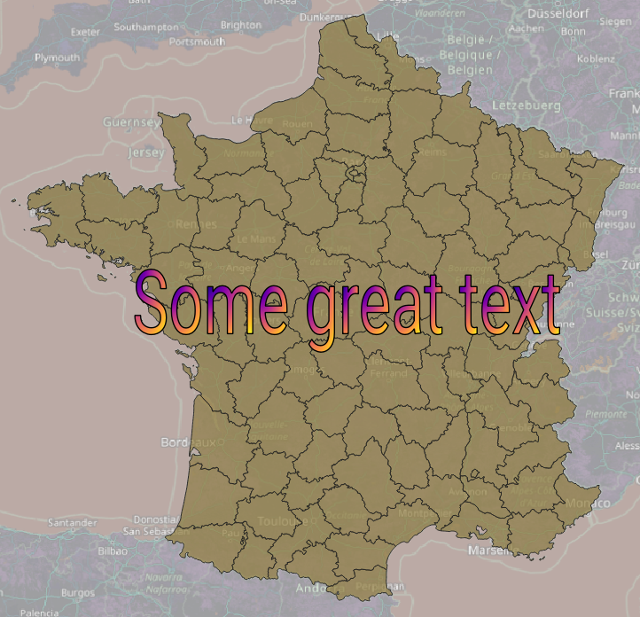

# Convert text to polygons in QGIS

This plugin adds an entry to the Processing toolbox, allowing you to convert a piece of text
to a layer of polygons.

Why? 

I needed this functionality, and thought it would be a good opportunity to integrate it into the Processing Toolbox.
Note that this plugin has not yet been published in QGIS Plugin Repository, but perhaps it will be.

## Instruction for developers

To install the plugin for development, you can clone the repository and manage the various actions with the `Makefile` provided.

Note that you need to have:
- pyqt5-dev-tools installed (`sudo apt install pyqt5-dev-tools`) to use the `pyrcc5` command,
- sphinx installed (`pip install sphinx` or `sudo apt install python3-sphinx`) to generate the documentation.

## License

[MIT](./LICENSE)
